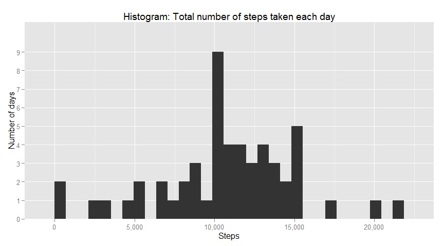
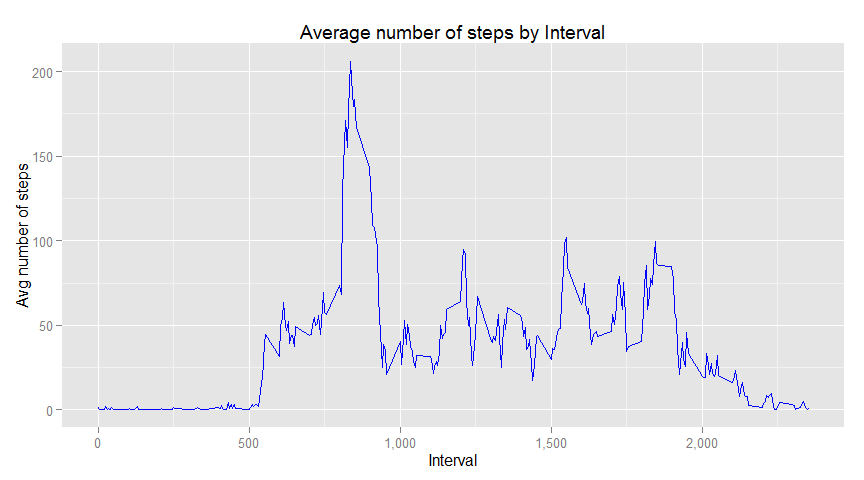
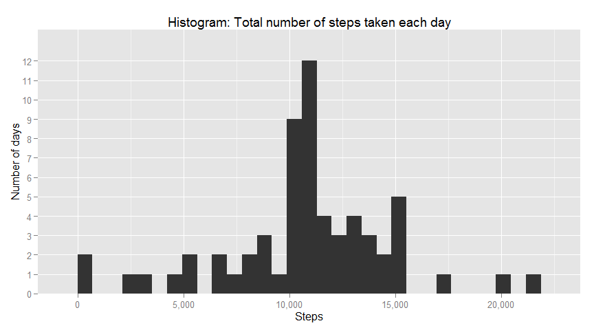
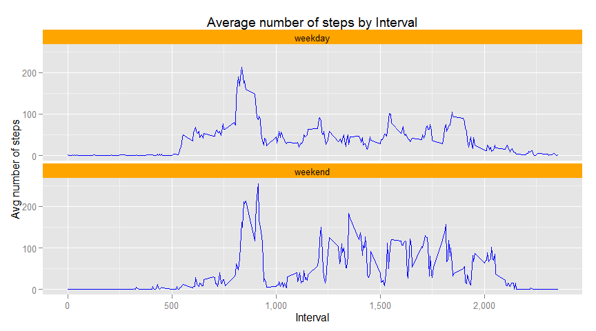

# Reproducible Research: Peer Assessment 1

## Loading and preprocessing the data

```r
unzip("activity.zip")
allData <- read.csv("activity.csv")

## get sqldf package for data processing with SQL
if(!require(sqldf)) {
    install.packages("sqldf"); library(sqldf);
}
if(!require(scales)) {
    install.packages("scales"); library(scales);
}
if(!require(ggplot2)) {
    install.packages("ggplot2"); library(ggplot2);
}

## remove missing data (NAs)
data <- sqldf("SELECT * FROM allData 
               WHERE steps IS NOT NULL")
```

## What is mean total number of steps taken per day?

```r
stepsByDay <- sqldf("SELECT sum(steps) as Steps, date as Date
                     FROM data 
                     GROUP BY date")
## histogram
ggplot(data = stepsByDay, aes(x = Steps)) + 
    geom_histogram() + 
    ggtitle("Histogram: Total number of steps taken each day") +
    scale_y_discrete(name = "Number of days") + 
    scale_x_continuous(labels = comma)
```

 

```r
mean(stepsByDay$Steps)
```

```
## [1] 10766.19
```

```r
median(stepsByDay$Steps)
```

```
## [1] 10765
```

## What is the average daily activity pattern?

```r
stepsByInterval <- sqldf("SELECT avg(steps) as AvgSteps, interval as Interval
                     FROM data 
                     GROUP BY interval")

ggplot(data = stepsByInterval, aes(x = Interval, y = AvgSteps)) + 
    geom_line(color = "blue") + 
    ggtitle("Average number of steps by Interval") +
    scale_y_continuous(name = "Avg number of steps") + 
    scale_x_continuous(labels = comma)
```

 

```r
## print max average steps
sqldf("SELECT Interval, AvgSteps as MaxAvgSteps 
       FROM stepsByInterval 
       ORDER BY AvgSteps DESC
       LIMIT 1")
```

```
##   Interval MaxAvgSteps
## 1      835    206.1698
```

## Imputing missing values

```r
## print number of missing values
sqldf("SELECT count(*) as total_missing_values 
       FROM allData 
       WHERE steps IS NULL")
```

```
##   total_missing_values
## 1                 2304
```

```r
missingValues <- sqldf("SELECT * 
                        FROM allData 
                        WHERE steps IS NULL")

## replace missing value with rounded average value for that interval
replacedmissingValues <- sqldf("SELECT round(i.AvgSteps) as steps, m.date, m.interval
                                FROM missingValues m INNER JOIN stepsByInterval i
                                    ON m.interval = i.Interval") 

data <- rbind(data, replacedmissingValues)

stepsByDay <- sqldf("SELECT sum(steps) as Steps, date as Date
                     FROM data 
                     GROUP BY date")
## histogram
ggplot(data = stepsByDay, aes(x = Steps)) + 
    geom_histogram() + 
    ggtitle("Histogram: Total number of steps taken each day") +
    scale_y_discrete(name = "Number of days") + 
    scale_x_continuous(labels = comma)
```

 

```r
mean(stepsByDay$Steps)
```

```
## [1] 10765.64
```

```r
median(stepsByDay$Steps)
```

```
## [1] 10762
```

```r
## slightly different values
```


## Are there differences in activity patterns between weekdays and weekends?

```r
data$weekend <- factor(as.POSIXlt(data$date, format="%Y-%m-%d")$wday %in% c(6,7), 
                       levels = c(TRUE, FALSE), 
                       labels = c("weekend", "weekday")
                )

stepsByIntervalAndWeekday <- sqldf("SELECT avg(steps) as AvgSteps, 
                                        interval as Interval,
                                        weekend as Weekend
                                    FROM data 
                                    GROUP BY weekend, interval")

ggplot(data = stepsByIntervalAndWeekday, aes(x = Interval, y = AvgSteps)) + 
    geom_line(color = "blue") + 
    facet_wrap( ~ Weekend, nrow = 2) +
    ggtitle("Average number of steps by Interval") +
    scale_y_continuous(name = "Avg number of steps") + 
    scale_x_continuous(labels = comma) +
    theme(strip.background = element_rect(fill = "orange"))
```

 


